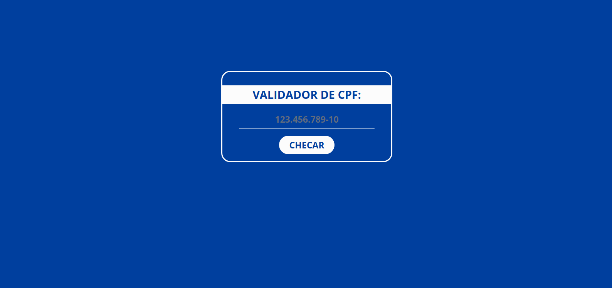

<h1 align="center">Cpf-Validator.js
	<br/>
	
	<br/>
</h1>

[](https://github.com/LeoMSSilva)
[](https://github.com/LeoMSSilva)
[](#)
[](https://github.com/LeoMSSilva/cpfValidator.js/stargazers)
[](https://github.com/LeoMSSilva/cpfValidator.js/network/members)
[](https://github.com/LeoMSSilva/cpfValidator.js/graphs/contributors)

---

# :pushpin: Table of Contents


- :house: [About](#house-about)
- :rocket: [Getting started](#rocket-getting-started)
- :computer: [Techs](#computer-techs)
- :bust_in_silhouette: [Author](#bust_in_silhouette-author)
- :handshake: [Contributing](#handshake-contributing)
- :scroll: [License](#scroll-license)

---

# :house: About

This project contains a cpf validator developed while studying **javaScript**.

It aims to deepen my knowledge and generate something useful while I study.

---

## :rocket: Getting Started

**Then in order, clone the project.**

By HTTPS, running this command:

```bash
  git clone https://github.com/LeoMSSilva/cpfValidator.js.git
```

Or by ssh, running this command:

```bash
  git clone git@github.com:LeoMSSilva/cpfValidator.js.git
```

SSH is a secure protocol, but you need to register a key ssh in your github before.

---

# :computer: Techs

- Javascript

---

# :bust_in_silhouette: Author

**LeoMSSilva**

- Github: [@LeoMSSilva](https://github.com/LeoMSSilva)
- LinkedIn: [@LeoMSSilva](https://linkedin.com/in/LeoMSSilva)

---

# :handshake: Contributing

Contributions, issues and feature requests are welcome! Feel free to **file a new issue** on the [cpfValidator.js](https://github.com/LeoMSSilva/cpfValidator.js/issues) repository. If you already found a solution to your problem, **I would love to review your pull request**!

---

# :scroll: License

Copyright :copyright: 2022 [LeoMSSilva](https://github.com/LeoMSSilva).
<br/>
This project is [MIT](https://github.com/LeoMSSilva/cpfValidator.js/blob/main/LICENSE) licensed.

---
